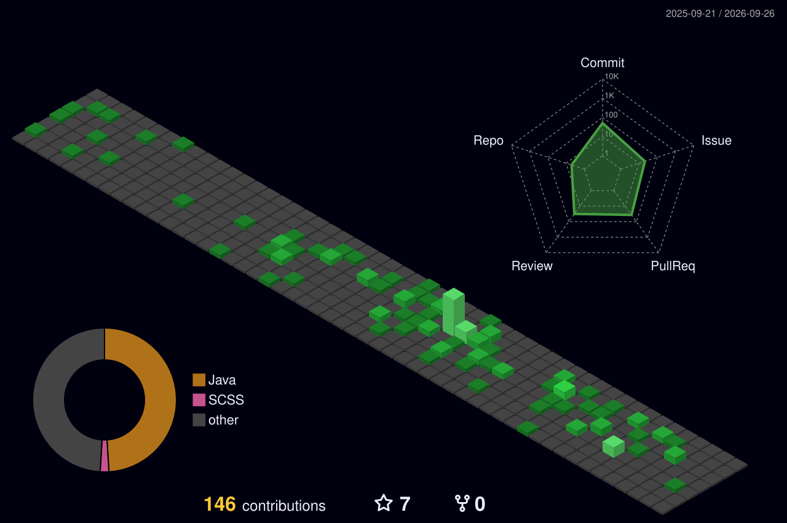
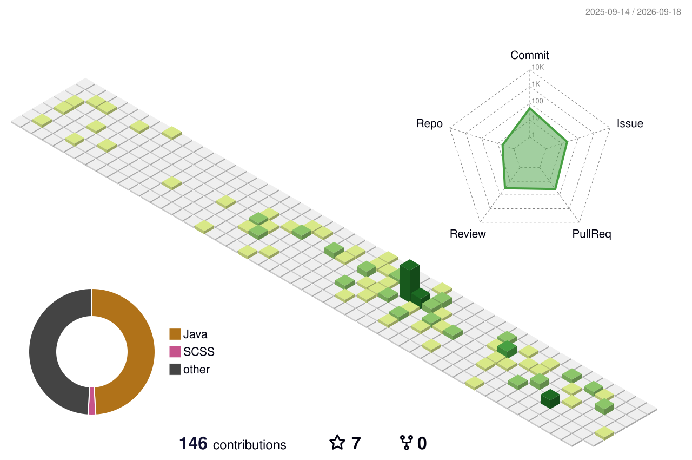
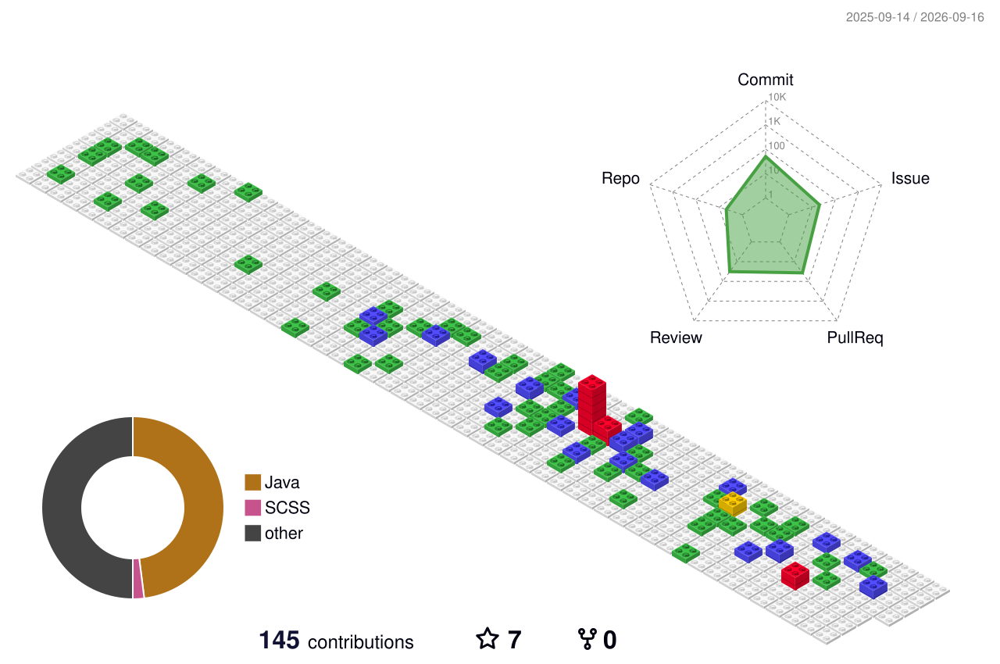

<!-- ============================================================ -->
<!-- BANNER OPTIONS — pick one, tell me which to keep             -->
<!-- ============================================================ -->

<!-- OPTION 1: Typing Animation -->
<h3 align="center">Option 1: Typing Animation</h3>

  

---

<!-- OPTION 2: Wave Banner -->
<h3 align="center">Option 2: Wave Banner</h3>

  

---

<!-- OPTION 3: Gradient Rectangle -->
<h3 align="center">Option 3: Gradient Rectangle</h3>

  

---

<!-- OPTION 4: Cylinder Banner -->
<h3 align="center">Option 4: Cylinder Banner</h3>

  

---

<!-- OPTION 5: 3D Contribution Graph (night green) -->
<h3 align="center">Option 5a: 3D Contribution Graph (Night Green)</h3>

  

---

<h3 align="center">Option 5b: 3D Contribution Graph (Night Rainbow)</h3>

  

---

<h3 align="center">Option 5c: 3D Contribution Graph (Green Animated)</h3>

  

---

<h3 align="center">Option 5d: 3D Contribution Graph (Git Block)</h3>

  

---

<!-- ============================================================ -->
<!-- END OF BANNER OPTIONS — everything below stays                -->
<!-- ============================================================ -->

<h1 align="center">Hey, I'm Srikanth Padakanti 👋</h1>

<h3 align="center">Software Engineer at Apple | OpenSearch Contributor</h3>

  

<h3 align="center">🛠 Languages and Tools</h3>

  

    

        
    

    

        <h3>🔗 Let's Connect</h3>
        

            
            
            
        

        <h3>✨ Fun Facts</h3>
        <ul>
            <li>I love hackathons, swimming and cricket.</li>
            <li>I enjoy building end to end observability pipelines from scratch.</li>
            <li>I contribute to open source because I use it every day.</li>
        </ul>
        <h3>🧑‍💻 About Me</h3>
        

            Software engineer focused on distributed systems, data pipelines, and observability.
            Contributor to the OpenSearch project with work across Data Prepper, the SQL plugin,
            and OpenSearch core. Built the Prometheus ingestion pipeline for OpenSearch including
            the Remote Write source, scrape source, and TSDB sink support.
        

        

            Currently exploring time series storage engines, query optimization, and bridging
            the gap between Prometheus and OpenSearch for unified observability.
        

    

  

