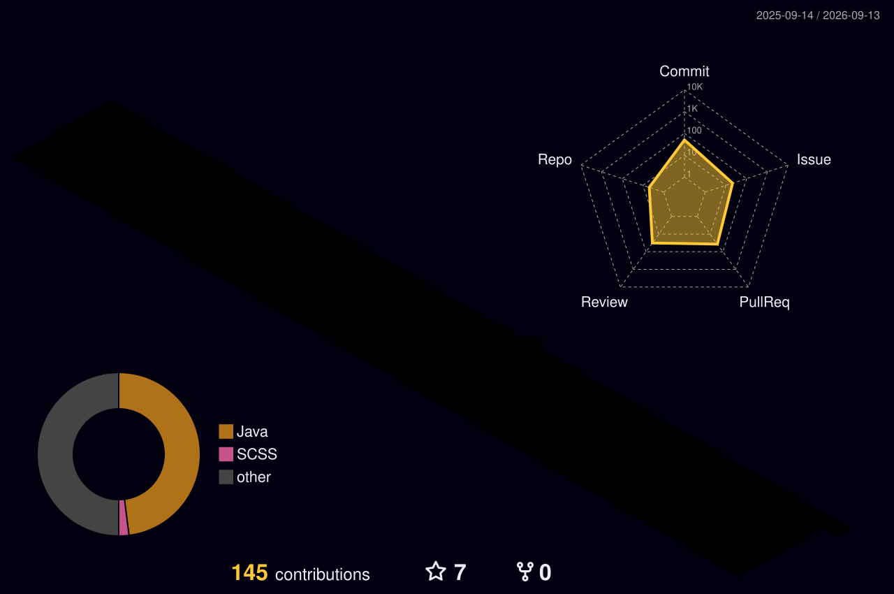

<!-- Snake Banner -->

<!-- Greeting -->
<h1 align="center">Hey, I'm Srikanth Padakanti 👋</h1>
<h3 align="center">Software Engineer at Apple | Austin, TX</h3>

Search enthusiast. Distributed systems. Open source contributor.

<!-- Social -->

  
  
  

---

<!-- About -->
<h3>🧑‍💻 About Me</h3>

Software engineer who builds and scales distributed systems. Passionate about search, data pipelines, and observability infrastructure. Open source contributor with a focus on making complex systems simpler to operate.

- 🔍 Passionate about search engines and information retrieval
- 🏗 I enjoy building end to end observability pipelines from scratch
- 🏏 I love hackathons, swimming and cricket
- 🌱 I contribute to open source because I use it every day

---

<!-- Tech Stack -->
<h3 align="center">🛠 Languages and Tools</h3>

  

---

<!-- GitHub Metrics + Snake -->
<h3>📊 GitHub Stats</h3>

  

---

<!-- Activity Graph -->

---

<!-- 3D Contributions -->
<h3>🏔 3D Contribution Map</h3>

  

---

<!-- Recent Activity -->
**:zap: Recent Activity:**

<!--START_SECTION:activity-->
1. ℹ️ Labeled issue [#6782](https://github.com/opensearch-project/data-prepper/issues/6782) in [opensearch-project/data-prepper](https://github.com/opensearch-project/data-prepper)
2. ❗ Opened issue [#6782](https://github.com/opensearch-project/data-prepper/issues/6782) in [opensearch-project/data-prepper](https://github.com/opensearch-project/data-prepper)
3. 🗣 Commented on [#6760](https://github.com/opensearch-project/data-prepper/issues/6760#issuecomment-4332618275) in [opensearch-project/data-prepper](https://github.com/opensearch-project/data-prepper)
4. 💪 Opened PR [#6776](https://github.com/opensearch-project/data-prepper/pull/6776) in [opensearch-project/data-prepper](https://github.com/opensearch-project/data-prepper)
5. 💪 Opened PR [#6774](https://github.com/opensearch-project/data-prepper/pull/6774) in [opensearch-project/data-prepper](https://github.com/opensearch-project/data-prepper)
<!--END_SECTION:activity-->

  

